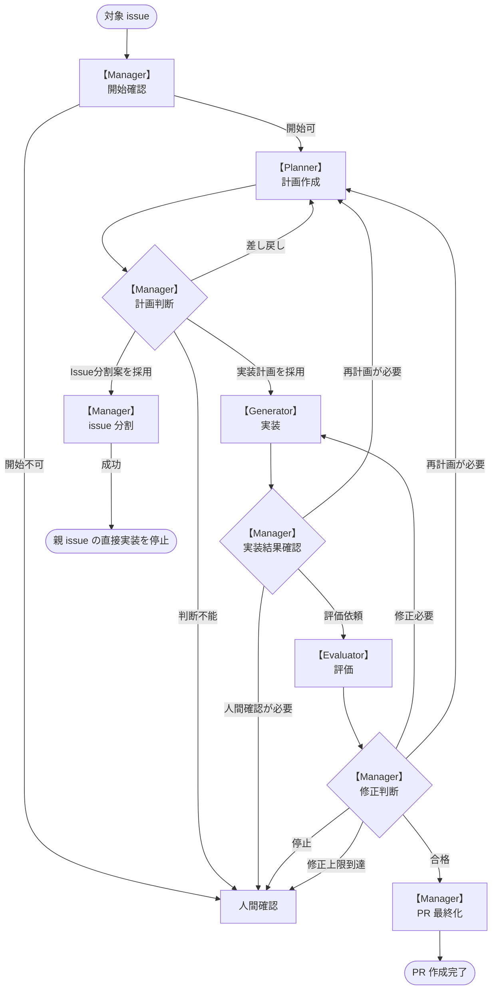

# エージェント開発ワークフロー

このファイルは、issue を起点にエージェントが自律的に開発作業を進めるための全体フローを定義する。

## 前提

- 1サイクルで扱うタスクは**1 issue**のみ
- issueとPRは**1対1**で紐づける
- エージェントの成果物(ソースコードは除く)・ログは**issueにコメントとして残す**
- この文書は `docs/agent` 配下のロール定義と合わせて、エージェント開発ワークフロー仕様の正本として扱う
- 具体的なコマンド、コメント本文の整形、反復手順は各 skill に外部化する

## 設計原則

このワークフローは、長時間の自律的な開発作業で文脈の混線、自己評価への偏り、過剰な手順固定が起きることを前提に設計する。
参考資料として Anthropic Engineering Blog の "Harness design for long-running application development" (2026-03-24) を扱うが、現行リポジトリの issue / PR 運用に必要な範囲だけを採用する。

### ロール分離

Manager / Planner / Generator / Evaluator は、同じ作業を重複して担当するためではなく、判断の性質を分けるために分離する。

- Manager はフェーズ移行、採用可否、人間確認、外部副作用を判断する
- Planner は要件、スコープ、受け入れ条件、Generator が満たすべき実装契約を整理する
- Generator は採用済みの実装契約を満たす範囲で実装手段を選び、変更と検証を行う
- Evaluator は Generator と分離した立場で差分、検証結果、受け入れ条件をレビューする

Planner / Generator / Evaluator を分ける理由は、計画、実装、評価を同じ文脈の自己正当化に寄せないためである。
特に Evaluator は Generator の自己評価を追認する役割ではなく、独立したレビューとして不具合、不足、検証漏れ、スコープ逸脱を確認する。

### 実装契約と実装裁量

Planner は詳細な実装手順を過度に固定しない。
事前に細かな手順を固定しすぎると、誤った前提が後続の実装へ連鎖し、Generator がコードベースの実態に合わせてよりよい手段を選びにくくなる。

Planner Output の `implementation-plan` は、Generator に渡す structured handoff artifact として次を明確にする。

- 実装後に成立しているべき振る舞い
- 変更してよい責務境界
- 変更してはいけないスコープ外事項
- 受け入れ条件と検証観点
- Generator が判断してよい軽微な実装裁量
- Manager に戻すべき未決定事項

Generator はこの契約を満たす範囲で、既存設計、コードスタイル、検証可能性に合わせて実装方法を選ぶ。
契約の前提が崩れた場合やスコープ変更が必要な場合は、独断で広げず Manager に戻す。

### Output と handoff

Planner Output、Generator Output、Evaluator Output、Manager Log は、会話の一時的な文脈ではなく structured handoff artifact として扱う。
issue コメントに保存することで、別ロールや後続セッションが同じ判断材料を参照できるようにする。

Output には、次フェーズの判断に必要な根拠、受け入れ条件への対応、検証結果、未解決事項を残す。
既存 Output コメントは履歴として保持し、編集や削除で判断過程を失わせない。

### 複雑性の扱い

開発ワークフローの複雑性を増やす変更は、失敗モードに対する必要性を説明できる場合に限って採用する。
ロール追加、反復回数の増加、契約交渉フロー、外部 SDK 依存、hook / rules 実装の追加は、品質向上より運用負荷や失敗経路を増やす可能性がある。

標準フローでは次の論点を採用しない。

- sprint 制の導入: 現行仕様は 1 issue / 1 PR を最小単位としており、さらに sprint を重ねる必要性が説明できない
- Planner と Generator の契約交渉ループ: Manager の計画判断と修正判断で十分に制御でき、追加ループは責務境界を複雑にする
- 新しい agent ロールの追加: Manager / Planner / Generator / Evaluator の責務で受け入れ条件を満たせる
- 外部 SDK 依存の追加: 現行の `gh`、git、skill、issue コメント運用で handoff と検証記録を実現できる
- `.codex` の hooks / rules 実装変更: 失敗モードと必要性が明確な場合だけ、実行制御の変更として個別に扱う

## ロール定義

開発ワークフローにおけるエージェントのロールを定義する。各ロールの詳細は `roles/*.md` に記載する。

### Manager (Main Agent)

- 開発ワークフロー全体の管理を行う
- 開発サイクルの開始・PR作成・人間へのフォールバック判断を行う
- 詳細: [roles/manager.md](./roles/manager.md)

#### I/O

- 入力: 対象 issue、各エージェントの成果物、ユーザからの判断・補足
- 出力: 各エージェントへの依頼、フェーズ移行の判断、PR作成、ユーザへのフォールバック

### Planner (Sub Agent)

- Issue を分析し、要件・スコープ・受け入れ条件・Generator が満たすべき実装契約を整理する
- 詳細: [roles/planner.md](./roles/planner.md)

#### I/O

- 入力: 対象 issue、マイルストーン情報、関連する issue / PR / ドキュメント
- 出力: Planner Output

### Generator (Sub Agent)

- Planner の実装計画に沿ってコード・ドキュメントを変更する
- Evaluator の指摘に基づいて修正する
- 詳細: [roles/generator.md](./roles/generator.md)

#### I/O

- 入力: Planner Output、修正ループ時の Evaluator Output
- 出力: Generator Output

### Evaluator (Sub Agent)

- Generator の実装結果をレビューし、合格 / 修正必要 / 停止を判定する
- 詳細: [roles/evaluator.md](./roles/evaluator.md)

#### I/O

- 入力: Generator Output
- 出力: Evaluator Output

## 基本フロー

## フェーズとskill

| フェーズ   | 主担当    | 使用 skill              | 概要                                                   |
| ---------- | --------- | ----------------------- | ------------------------------------------------------ |
| 開始確認   | Manager   | `start-workflow`           | 対象 issue と開始条件を確認する                        |
| 計画作成   | Planner   | `issue-planning`        | 実装計画または issue 分割案を作成する                  |
| 計画判断   | Manager   | `plan-review`         | Planner の成果物の採用可否と扱いを判断する             |
| issue 分割 | Manager   | `issue-splitting`       | 採用した issue 分割案に基づいてサブ issue を作成する   |
| 実装       | Generator | `impl-commit` | 実装計画に沿って変更し、issue スコープ内で commit する |
| 評価       | Evaluator | `impl-evaluation`     | 実装結果をレビューし、評価結果を判定する               |
| 修正判断   | Manager   | `fix-decision`              | Evaluator の成果物に基づいて修正継続可否を判断する     |
| PR 最終化  | Manager   | `pr-finalization`       | PR 作成条件を確認し、push と PR 作成を行う             |

## 最小ドライラン

ハーネス運用のドライランは、issue 起点の 1 サイクルを `start-workflow` から `pr-finalization` 直前まで確認し、外部副作用を伴う操作は実行しない。
目的は、各ロールの入力、Output、フェーズ遷移、記録の不足を見つけ、後続 issue 化できる粒度で残すことである。

### 確認できる範囲

- 対象 issue が 1 つに確定しているか確認する
- 現在ブランチ、作業ツリー、必要な `AGENTS.md` を確認し、開始可否を判断できるか確認する
- Planner Output が `implementation-plan` または `split-proposal` のどちらか一方として読めるか確認する
- Manager が Planner Output の採用、差し戻し、分割、人間確認のいずれかを判断できるか確認する
- Generator が採用済み `implementation-plan` に沿って issue スコープ内の変更、検証、明示 stage、commit、Generator Output 作成を行えるか確認する
- Evaluator が Generator Output と commit を基に `pass`、`needs-fix`、`blocked` のいずれかを判断できるか確認する
- Manager が Evaluator Output を基に修正継続、再計画、人間確認、PR 最終化のいずれへ進めるか判断できるか確認する
- `pr-finalization` の PR 作成前チェックを、push と PR 作成を行わずに確認する
- 各 Output に対象 issue、Type または Result、commit、検証結果、未解決事項が記録されているか確認する

### 実行しない外部副作用

ドライラン中は、次の操作を実行しない。
これらが必要になる地点では、実行予定のコマンド、前提、未確認事項を記録して停止する。

- 既存 issue 本文や既存コメントの編集
- 実際のサブ issue 作成
- 実際の push
- 実際の PR 作成
- 実際の PR 編集
- 作成済み issue、コメント、PR、branch の削除
- 破壊的 git 操作

### Manager が本番実行時に責任を持つ範囲

ドライランで外部副作用を止めた後、本番実行に進めるかは Manager が判断する。
Manager は本番実行時に次を確認し、実行結果を必要な Output または Manager Log に残す。

- `issue/{issue番号}` ブランチで作業していること
- `git status --short` に未コミット変更や untracked file がないこと
- Evaluator Output の `Result` が `pass` であること
- 対象 issue の assignee、label、milestone、project を取得できること
- `git push origin issue/{issue番号}` を remote と branch 明示で実行すること
- `gh pr create` で対象 issue と 1 対 1 の PR を作成すること
- issue メタデータを可能な範囲で PR に引き継ぐこと
- `AI: PR Created` を `output-comment` skill で投稿すること
- push、PR 作成、メタデータ引き継ぎ、コメント投稿の失敗時は `external-op-failure` skill に従うこと

### 不足記録

ドライランで不足や曖昧さを見つけた場合は、後続 issue に移せるように次の粒度で記録する。

- 対象フェーズ
- 対象 skill または正式ドキュメント
- 観測した不足
- 期待される判断または記録
- 外部副作用を伴うかどうか
- 後続 issue 化する場合の最小スコープ

## フェーズ遷移条件

| 現在フェーズ | 次フェーズ | 条件 |
| ------------ | ---------- | ---- |
| 開始確認 | 計画作成 | Manager が対象 issue、ブランチ、作業ツリー、関連ルールを確認し、開始可能と判断した |
| 開始確認 | 人間確認 | 開始条件を満たさない、または開始可否を自動判断できない |
| 計画作成 | 計画判断 | Planner Output が issue コメントとして保存された |
| 計画判断 | 実装 | Manager が `implementation-plan` を採用した |
| 計画判断 | issue 分割 | Manager が `split-proposal` を採用した |
| 計画判断 | 計画作成 | Manager が Planner Output の修正を依頼した |
| 計画判断 | 人間確認 | Planner Output の採用可否、受け入れ条件、スコープ変更を自動判断できない |
| issue 分割 | 親 issue の直接実装停止 | Manager がサブ issue 作成と必要な記録を完了した |
| 実装 | 実装結果確認 | Generator Output が issue コメントとして保存され、issue スコープ内の commit が作成された |
| 実装結果確認 | 評価 | Manager が Generator Output と commit を評価可能と判断した |
| 実装結果確認 | 計画作成 | 実装中に計画の前提不一致や再計画が必要な事項が判明した |
| 実装結果確認 | 人間確認 | スコープ外変更、外部状態不明、または人間判断が必要な事項がある |
| 評価 | 修正判断 | Evaluator Output が issue コメントとして保存された |
| 修正判断 | PR 最終化 | Evaluator Output の Result が `pass` である |
| 修正判断 | 実装 | Evaluator Output の Result が `needs-fix` で、修正ループ回数が 2 回未満である |
| 修正判断 | 計画作成 | Planner Output の前提や受け入れ条件の見直しが必要で、issue スコープ内で再計画できる |
| 修正判断 | 人間確認 | Result が `blocked`、修正ループ回数が 2 回に到達、または自動判断できない |
| PR 最終化 | PR 作成完了 | Manager が PR 作成条件を満たすことを確認し、対象 issue のメタデータを可能な範囲で引き継いで push と PR 作成を完了した |

PR 最終化へ進めるのは、Evaluator Output の Result が `pass` の場合だけとする。

## Output とコメント保存

Planner Output、Generator Output、Evaluator Output、Manager Log は対象 issue のコメントを正本の保存先とする。
投稿主体は次の通り。

| Output | 投稿主体 | コメント見出し | 扱い |
| ------ | -------- | -------------- | ---- |
| Planner Output | Planner | `AI: Planner Output` | `implementation-plan` または `split-proposal` を保存する |
| Generator Output | Generator | `AI: Generator Output` | 実装概要、変更内容、commit、検証結果、未解決事項を保存する |
| Evaluator Output | Evaluator | `AI: Evaluator Output` | Result、レビュー結果、検証結果、未解決事項を保存する |
| Manager Log | Manager | `AI: Manager Log` | 人間確認、外部副作用失敗、停止判断など必要時だけ保存する |

- 各ロールは Output 投稿に `output-comment` skill を使う
- 修正ループ時の Generator Output / Evaluator Output は新しい issue コメントとして投稿し、本文に `Loop: {番号}` を含める
- 修正ループ番号は 1 から始め、同一 issue の `Generator -> Evaluator` 再試行ごとに増やす
- 既存 Output コメントの編集・削除は原則行わない
- Output コメント投稿に失敗したロールは、自分で復旧判断せず Manager に戻す

## 修正ループ

- 修正ループは、Evaluator Output の Result が `needs-fix` の場合に Manager が継続可否を判断して開始する
- 同じ issue で `Generator -> Evaluator` の修正ループは最大 2 回までとする
- 修正ループ回数が 2 回に到達した場合、Manager は後続フェーズへ進めず人間確認へフォールバックする
- Evaluator Output の Result が `blocked` の場合、修正ループへ進めず人間確認へフォールバックする
- 修正に Planner Output の受け入れ条件やスコープ変更が必要な場合、Manager は Generator に直接修正依頼せず再計画または人間確認へ進める

### Issue分割について

- Issue 分割は、対象 issue を 1 PR で扱うよりも、複数の独立した issue として扱う方が安全に進められる場合に行う
- 分割を採用した場合は親 issue の直接実装は停止し、作成したサブ issue をそれぞれ独立した開発サイクルの対象にする
- サブ issue はそれぞれ 1 issue / 1 PR として扱い、対応 PR の closing keyword で close する
- 親 issue は最後のサブ issue の PR でだけ closing keyword の対象にする

#### 分割基準

- 1 PR で完了させるには変更範囲が広い
- 複数 package や複数機能にまたがり、受け入れ条件を分けた方が評価しやすい
- DB スキーマ、API 契約、UI、運用ドキュメントなど、リスクや検証観点が異なる作業が混在している
- 前段の設計・整備が完了しないと後続の実装に進めない

## 人間確認条件

次の場合は後続フェーズへ進まず、人間確認へフォールバックする。

- サイクルの開始条件を満たさない
- Planner の成果物の採用可否を判断できない
- セキュリティ、認証・認可、データ破壊、DB スキーマ、API 契約の判断が必要
- 修正ループが上限に達した
