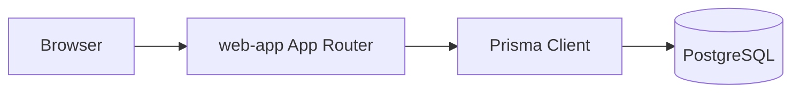
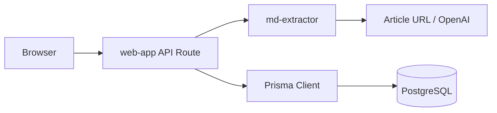
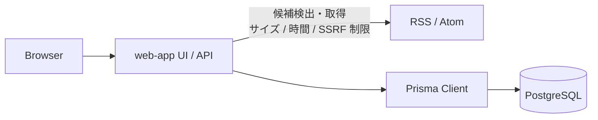

# データフロー

この文書は、package をまたぐ主要なデータフローだけを扱う。画面ごとの詳細仕様は `docs/features` を参照する。

## 記事一覧・詳細表示

- `packages/web-app` の Server Component が、Prisma Client 経由で PostgreSQL から記事データを取得する
- DB 構造の正本は `packages/db/prisma/schema.prisma`

## 記事保存

- 記事 URL からのマークダウン抽出は `md-extractor` に委譲する
- `web-app` は `md-extractor` のレスポンスを Web API のレスポンスへ変換する
- 保存時は `web-app` が Prisma Client 経由で PostgreSQL に記事、入力元、コメント、タグ関連を保存する
- `md-extractor` は記事データを永続化しない

## 登録サイト

- 登録サイトのフィード検出・取得・解析は `web-app` の API で処理する
- 解析結果はユーザごとの `registered_sites` と `feed_entries` に保存し、画面のページングは DB キャッシュだけを読む
- 通常のタブアクセスでは Browser が登録先ごとの更新 API を順次呼び出し、`web-app` はリクエストごとに TTL を再確認して 1 件だけ期限切れ登録先を更新する。ページ移動と履歴操作はキャッシュ読み取りだけを行う
- 表示順は `registered_sites.sort_order` に保存し、並べ替え API では URL のユーザに属する ID だけを更新する
- `fetch_token` と登録先行ロックで同じユーザの重複取得と古い結果の上書きを防ぐ
- 保存済み記事は既存の記事登録 API で別管理し、フィードキャッシュの削除による影響を受けない
