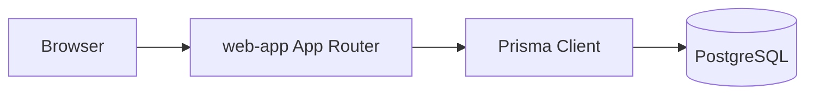
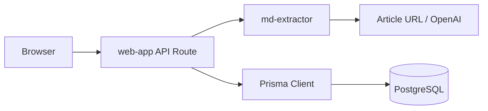

# データフロー

この文書は、package をまたぐ主要なデータフローだけを扱う。画面ごとの詳細仕様は `docs/features` を参照する。

## 記事一覧・詳細表示

- `packages/web-app` の Server Component が、Prisma Client 経由で PostgreSQL から記事データを取得する
- DB 構造の正本は `packages/db/prisma/schema.prisma`

## 記事保存

- 記事 URL からのマークダウン抽出は `md-extractor` に委譲する
- `web-app` は `md-extractor` のレスポンスを Web API のレスポンスへ変換する
- 保存時は `web-app` が Prisma Client 経由で PostgreSQL に記事、入力元、コメント、タグ関連を保存する
- `md-extractor` は記事データを永続化しない
