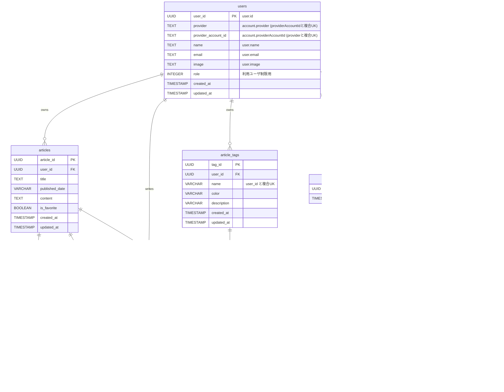

```mermaid
erDiagram
    users {
        UUID user_id PK "user.id"
        TEXT provider "account.provider (providerAccountIdと複合UK)"
        TEXT provider_account_id "account.providerAccountId (providerと複合UK)"
        TEXT name "user.name"
        TEXT email "user.email"
        TEXT image "user.image"
        INTEGER role "利用ユーザ制限用"
        TIMESTAMP created_at
        TIMESTAMP updated_at
    }

    articles {
        UUID article_id PK
        UUID user_id FK
        TEXT title
        VARCHAR published_date
        TEXT content
        BOOLEAN is_favorite
        TIMESTAMP created_at
        TIMESTAMP updated_at
    }

    article_sources {
        UUID article_id PK, FK
        VARCHAR type
        TEXT url
        TIMESTAMP created_at
        TIMESTAMP updated_at
    }

    article_comments {
        UUID comment_id PK
        UUID article_id FK, UK
        UUID user_id FK
        TEXT comment
        TIMESTAMP created_at
        TIMESTAMP updated_at
    }

    article_tags {
        UUID tag_id PK
        UUID user_id FK
        VARCHAR name "user_id と複合UK"
        VARCHAR color
        VARCHAR description
        TIMESTAMP created_at
        TIMESTAMP updated_at
    }

    article_tags_articles {
        UUID article_id PK, FK
        UUID tag_id PK, FK
    }

    registered_sites {
        UUID registered_site_id PK
        UUID user_id FK
        TEXT site_url
        TEXT site_url_key
        TEXT display_name
        TEXT feed_url
        TEXT feed_url_key
        TIMESTAMPTZ last_success_at
        BIGINT cache_version
        UUID fetch_token
        TIMESTAMPTZ fetch_not_before
        TIMESTAMPTZ created_at
        TIMESTAMPTZ updated_at
    }

    feed_entries {
        UUID feed_entry_id PK
        UUID registered_site_id FK
        VARCHAR entry_key
        TEXT source_entry_id
        TEXT article_url
        TEXT title
        TEXT thumbnail_url
        TIMESTAMPTZ published_at
        TIMESTAMPTZ first_seen_at
        TIMESTAMPTZ updated_at
    }

    site_tab_states {
        UUID user_id PK, FK
        TIMESTAMPTZ last_accessed_at
    }

    users ||--o{ articles : owns
    articles ||--|| article_sources : has
    articles ||--o| article_comments : has
    users ||--o{ article_comments : writes
    users ||--o{ article_tags : owns
    articles ||--o{ article_tags_articles : has
    article_tags ||--o{ article_tags_articles : has
    users ||--o{ registered_sites : registers
    users ||--o| site_tab_states : visits
    registered_sites ||--o{ feed_entries : caches
```
