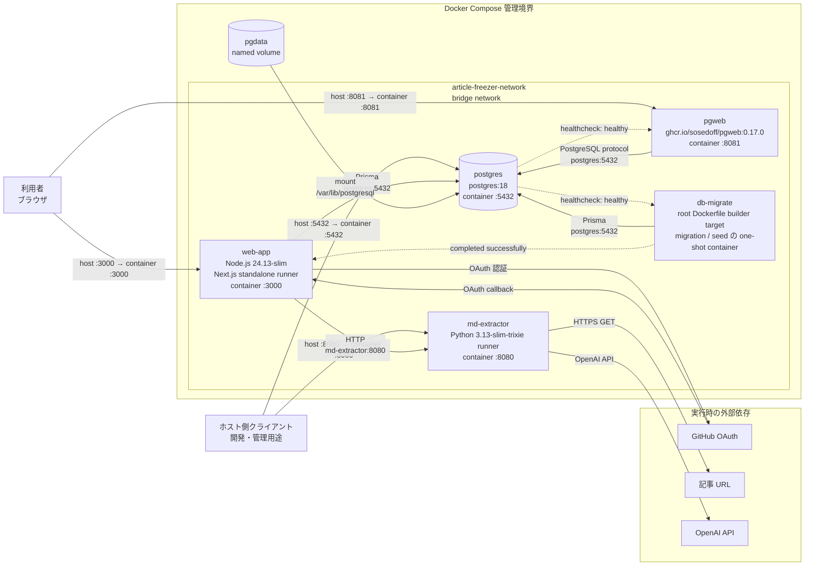

# インフラ構成

この文書は、現行の Docker Compose 構成におけるサービスの配置、ポート、起動依存、永続 volume、実行時の外部接続を示す。
各 package の責務やデータの流れを示す論理構成は、[システム構成](./system-overview.md)を参照する。

ルートの `compose.yaml` は `packages/db/compose.yaml` と `packages/md-extractor/compose.yaml` を include する。
以下は 3 ファイルを合わせた現行のローカル実行構成であり、本番環境や特定のクラウド構成を示すものではない。

## 構成図

## 図の読み方

- Docker Compose 管理境界内の 5 サービスは、同じ `article-freezer-network` bridge network に接続する
- 実線は利用者またはアプリケーションによる通信と volume mount、破線は Compose の起動条件を示す
- `host :port → container :port` はホストへ publish されたポート、`service:port` は Compose network 内のサービス名による接続先を示す
- `packages/db` は `web-app` と `db-migrate` から利用する package であり、独立したサービスとしては配置されない
- 実行時の外部依存だけを示し、image registry や package registry などの build 時の接続先は含めない

## サービスと実行 image

| サービス | 実行 image / stage | 役割 |
| --- | --- | --- |
| `web-app` | ルート `Dockerfile` の `runner` stage。`node:24.13-slim` 系 | Next.js standalone server を非 root の `node` ユーザで実行する常駐サービス |
| `md-extractor` | `packages/md-extractor/Dockerfile` の `runner` stage。`python:3.13-slim-trixie` 系 | FastAPI の記事抽出 API を非 root ユーザで実行する常駐サービス |
| `postgres` | `postgres:18` | アプリケーションデータを永続化する PostgreSQL |
| `pgweb` | `ghcr.io/sosedoff/pgweb:0.17.0` | PostgreSQL を確認する管理 UI |
| `db-migrate` | ルート `Dockerfile` の `builder` target | Prisma migration と seed を順に実行して終了する one-shot container |

`web-app` の runner はコンテナ内の `0.0.0.0:3000`、`md-extractor` の runner は既定で `0.0.0.0:8080` を listen する。

## ポートと内部通信

| ホスト側 | コンテナ側 | 接続先 | 主な用途 |
| --- | --- | --- | --- |
| `3000` | `web-app:3000` | `web-app` | ブラウザから Web アプリを利用する |
| `8080` | `md-extractor:8080` | `md-extractor` | ホストから記事抽出 API へ接続する |
| `8081` | `pgweb:8081` | `pgweb` | ブラウザから pgweb を利用する |
| `5432` | `postgres:5432` | `postgres` | ホストから PostgreSQL へ接続する |

Compose network 内では、`web-app` が `http://md-extractor:8080` を使用する。
`web-app`、`db-migrate`、`pgweb` は、ホスト公開ポートを経由せずサービス名 `postgres` とコンテナ側 port `5432` で PostgreSQL に接続する。

これらの publish 設定は現行のローカル実行定義を記録したものであり、本番環境で同じポートを公開することを推奨または保証するものではない。

## 起動依存と永続化

1. `postgres` の healthcheck は、コンテナ内で `psql` により接続可能かを確認する
2. `postgres` が healthy になると、`db-migrate` が Prisma migration と seed を実行する
3. `db-migrate` が正常終了すると、`web-app` が起動する
4. `pgweb` は `postgres` が healthy になった後に起動する

`md-extractor` には Compose 上の起動依存や readiness 条件が定義されていない。
`depends_on` は外部依存の可用性や、起動後の継続的な正常性を保証しない。

named volume の `pgdata` は、`postgres` の `/var/lib/postgresql` に mount される。
volume のホスト上の実体配置、バックアップ、冗長化は Compose 定義の範囲外である。

## 構成の正本

- [ルート Compose](../../compose.yaml): include、`db-migrate`、`web-app`、共有 network の定義
- [DB Compose](../../packages/db/compose.yaml): `postgres`、`pgweb`、`pgdata`、healthcheck の定義
- [md-extractor Compose](../../packages/md-extractor/compose.yaml): `md-extractor` の定義
- [ルート Dockerfile](../../Dockerfile): `web-app` runner と `db-migrate` が利用する builder stage の定義
- [md-extractor Dockerfile](../../packages/md-extractor/Dockerfile): Python runner の定義
