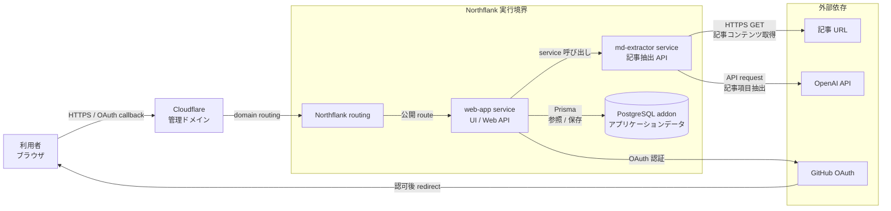
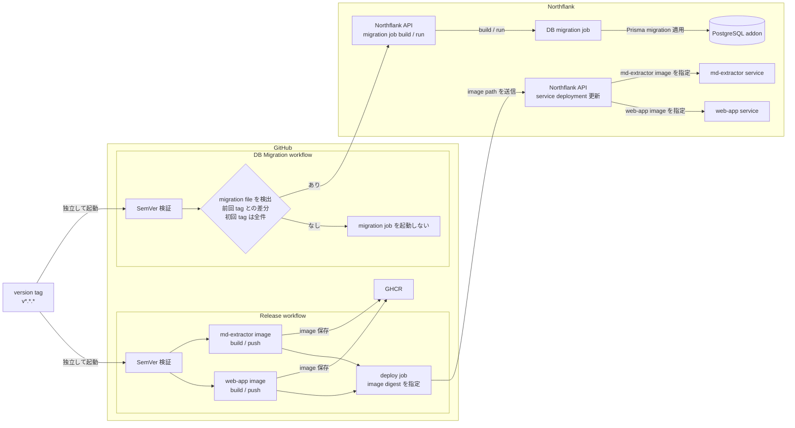

# 本番インフラ構成

この文書は、デプロイ調査と現行の GitHub Actions workflow から確認できる範囲で、Article Freezer の本番利用時の実行経路とデプロイ経路を示す。

各 package の責務やデータの流れを示す論理構成は、[システム構成](./system-overview.md)を参照する。

実際の domain 名、Northflank のリソース ID、credential、token、secret は記載しない。

また、指定資料から確定できない Northflank 内部の network topology、リージョン、冗長化、backup、TLS 終端などは図の対象外とする。

## 本番利用時の実行経路

### 図の読み方

- 利用者は Cloudflare で管理する domain を入口とし、Northflank routing を経由して `web-app` service を利用する
- GitHub OAuth の callback も同じ公開経路を通って `web-app` service に戻る
- `web-app` service は `md-extractor` service を呼び出し、Prisma Client 経由で PostgreSQL addon を参照・更新する
- `md-extractor` service は記事 URL からコンテンツを取得し、OpenAI を利用して記事項目を抽出する
- 記事の永続化は `web-app` service が担当する。`md-extractor` service は PostgreSQL addon に記事を保存しない
- `web-app` service から `md-extractor` service への矢印は実行時の呼び出し関係を示すものであり、接続方式や公開設定などの network topology を示すものではない

## デプロイ経路

### 図の読み方

- `v*.*.*` の version tag を push すると、Release workflow と DB Migration workflow がそれぞれ独立して起動する
- `GITHUB_TOKEN` は CI と migration 差分検出では `contents: read`、image 公開では `contents: read` / `packages: write`、release 作成では `contents: write` に制限する。タグ検証と Northflank API 呼び出しの job には GitHub の権限を付与せず、checkout 後に認証情報を保持しない
- Release workflow は SemVer を検証し、`web-app` と `md-extractor` ごとに共通の Build and publish image workflow を呼び出し、image を build / push して GHCR に保存する。各 job の出力に image digest を保持し、service ごとに対応する値を渡す
- Release workflow は Northflank API で各 service の deployment を更新し、GHCR image を `@sha256:...` の digest で指定する。build / deploy の各段階で digest の形式を検証し、欠落や不正値がある場合は失敗する
- DB Migration workflow は SemVer を検証し、前回の version tag から `packages/db/prisma/migrations` の差分を検出する。前回の tag がない初回 release では、現在の commit 配下にある migration file 全件を検出対象にする
- migration file に差分がある場合だけ、Northflank API で DB migration job を build / run し、job が PostgreSQL addon に migration を適用する。差分がなければ job は起動しない
- migration の build には version tag の checkout から取得した commit SHA を指定する。成功した build の ID と SHA が要求値に一致することを確認し、その build ID と branch を run に指定する。API 応答の ID / branch は検証後に step output と環境変数で渡す
- workflow は DB migration job の build 完了を待ってから run を開始するが、run の完了・成功は待機しない。GitHub Actions の成功は DB migration の完了成功を保証しない

> [!IMPORTANT]
> 2 つの workflow は同じ version tag を契機に GitHub 上で独立して起動する。
>
> service deployment と DB migration の間に、実行順序や成功依存の保証はない。

## 責務境界

| 対象 | この文書で示す責務 |
| --- | --- |
| Cloudflare 管理ドメイン | 利用者と GitHub OAuth callback が到達する公開入口 |
| Northflank routing | 公開入口から `web-app` service への routing 境界 |
| `web-app` service | UI / Web API、GitHub OAuth、`md-extractor` の呼び出し、PostgreSQL addon への参照・保存 |
| `md-extractor` service | 記事 URL の取得と OpenAI を利用した記事項目抽出 |
| PostgreSQL addon | アプリケーションデータの永続化と migration の適用先 |
| GHCR | Release workflow が build した 2 つの container image の保存先 |
| Northflank API | service deployment の更新と、条件付き DB migration job の build / run |

## 構成の根拠

- [Release workflow](../../.github/workflows/release.yaml): version tag、SemVer 検証、2 image の build / push、GHCR、Northflank service deployment 更新
- [Build and publish image workflow](../../.github/workflows/build-image.yaml): image ごとの共通 build / push 処理と digest の出力
- [DB Migration workflow](../../.github/workflows/db-migration.yaml): version tag、migration 差分検出、条件付き DB migration job の build / run
- [Issue #45: デプロイ方法調査](https://github.com/2-yudetama/article-freezer/issues/45): Northflank の service / addon 構成と GitHub Actions からのデプロイ方針
- [PR #46: リリース用の GitHub Actions を整備](https://github.com/2-yudetama/article-freezer/pull/46): Release workflow の実装
- [Issue #47: マイグレーション用 Actions の作成](https://github.com/2-yudetama/article-freezer/issues/47): migration 差分がある場合だけ実行する方針
- [PR #48: マイグレーション用の workflow を追加](https://github.com/2-yudetama/article-freezer/pull/48): DB Migration workflow の実装
- [Issue #49: 独自ドメイン取得](https://github.com/2-yudetama/article-freezer/issues/49): Cloudflare 管理ドメインと Northflank routing の設定方針

ローカル開発環境の構成は本番インフラとは分け、ルートおよび各 package の Compose 定義を正本とする。
