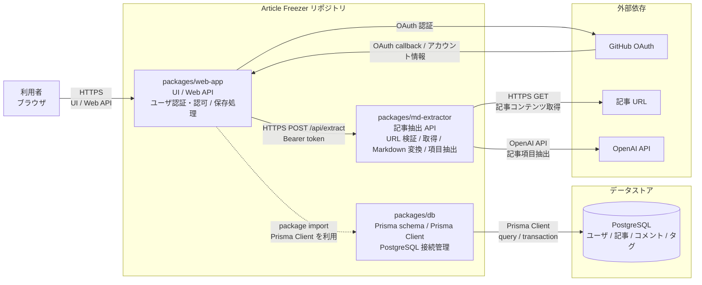

# システム構成

この文書は、Article Freezer の現行実装における論理コンポーネントと主要な接続を俯瞰するための入口。
本番利用時の公開入口、Northflank 上の配置、デプロイ経路は[本番インフラ構成](./infrastructure-overview.md)を参照する。

## 論理構成

## 図の読み方

- 実線の矢印は、実行時の主要な通信方向を示す
- `web-app` から `db` への破線は、HTTP 通信ではなく package の import と Prisma Client の利用を示す
- `db` の Prisma Client は `web-app` のサーバ側処理で実行され、PostgreSQL に接続する。`db` は独立した HTTP サービスではない
- 図は主要経路を示す。機能別の処理順序やデータ構造の詳細は関連資料を参照する

## コンポーネントの責務

| コンポーネント | 責務 |
| --- | --- |
| 利用者 | ブラウザから画面と Web API を利用する |
| `packages/web-app` | Next.js の UI と Web API、GitHub OAuth を利用したアプリユーザの認証・認可、記事などの保存処理を担当する |
| `packages/md-extractor` | Bearer token で service 間の呼び出しを認証し、URL の安全性検証、記事取得、Markdown 変換、OpenAI による記事項目抽出を担当する。記事は永続化しない |
| `packages/db` | Prisma schema、生成した Prisma Client、PostgreSQL の接続管理を提供する |
| PostgreSQL | ユーザ、記事、記事ソース、コメント、タグを永続化する |
| GitHub OAuth | `web-app` にアプリユーザのサインイン手段を提供する |
| 記事 URL | `md-extractor` が検証・取得する記事コンテンツを提供する |
| OpenAI API | Markdown からタイトル、公開日、本文を抽出する |

## 関連資料

- [本番インフラ構成](./infrastructure-overview.md): Cloudflare と Northflank を経由する本番利用時の実行経路、および GitHub Actions からのデプロイ経路
- [データフロー](./data-flow.md): 記事表示・保存の機能別フロー
- [認証・認可](./auth.md): アプリユーザ認証と service 間認証の境界
- [ER 図](./er.md): PostgreSQL に保存するデータ構造
- [記事保存](../features/article-registration.md): 記事抽出から保存までの機能仕様
- [md-extractor](../features/md-extractor.md): 記事抽出 API の詳細
