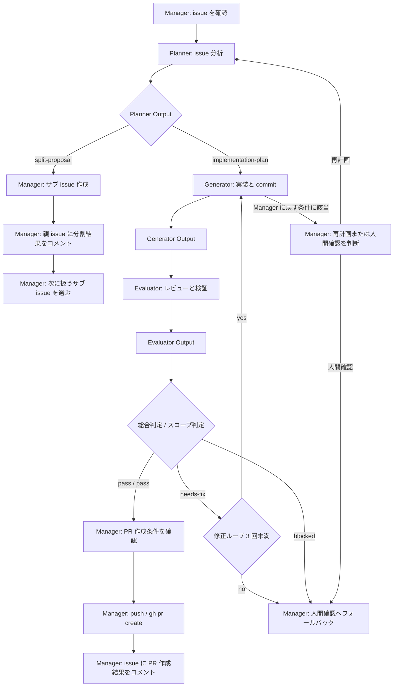

# ワークフロー正本ドラフト

このファイルは、正式移行時に `docs/agent/workflow.md` へ移すための元ドラフト。
Output 仕様、git / GitHub 操作ルール、分岐条件はこのファイルへ統合する。
具体的なコマンド例や本文整形手順は `.agents/skills/*` へ外部化する。

## 移行先

```txt
docs/agent/workflow.md
.agents/skills/start-workflow/SKILL.md
.agents/skills/plan-review/SKILL.md
.agents/skills/fix-decision/SKILL.md
.agents/skills/pr-finalization/SKILL.md
.agents/skills/external-op-failure/SKILL.md
```

## 分配方針

- フェーズ遷移、開始条件、完了条件、分岐条件は `docs/agent/workflow.md` へ移す
- Output 保存先、必須要素、PR 作成条件は `docs/agent/workflow.md` へ移す
- git / GitHub 操作の許可・禁止、外部副作用の実行条件は `docs/agent/workflow.md` へ移す
- 各フェーズの具体的なチェック手順は対応する `.agents/skills/*/SKILL.md` へ移す

## 基本フロー

```txt
Manager
  -> 対応 issue を確認する
  -> Planner に issue 分析と計画作成を依頼する

Planner
  -> implementation-plan または split-proposal を出す

Manager
  -> Planner の出力を確認する
  -> 実装可能なら Generator に依頼する
  -> 分割が必要ならサブ issue 作成フローへ進む

Generator
  -> 実装する
  -> セルフチェックする

Evaluator
  -> 実装結果をレビューする

Manager
  -> 修正要否を判断する
  -> PR 作成可能か判断する
```

## 全体フローチャート



## 実装後レビュー・修正ループ

```txt
Generator
  -> Generator Output を出す
  -> Manager が対象 issue に AI: Generator Output コメントを投稿する

Evaluator
  -> Evaluator Output を出す
  -> Manager が対象 issue に AI: Evaluator Output コメントを投稿する

Manager
  -> Evaluator Output を確認する

  if pass:
    PR 作成準備へ進む

  if needs-fix:
    Generator に修正を依頼する
    修正後、Evaluator に再レビューを依頼する

  if blocked:
    人間確認へフォールバックする
```

## 修正ループ上限

- 同じ issue で `Generator -> Evaluator` の修正ループは最大 3 回までとする
- 3 回で `pass` しない場合、Manager は人間確認へフォールバックする
- Evaluator が `blocked` を出した場合も、人間確認へフォールバックする
- フォールバック時は、必ず対象 issue に `AI: Manager Log` コメントを残し、Generator Output と Evaluator Output を添えて状況を報告する

## Manager への差し戻しフロー

Generator または Evaluator が Manager に戻した場合、Manager は次のいずれかを選ぶ。

- Planner に再計画を依頼する
- Planner に `split-proposal` を依頼する
- Generator に追加修正を依頼する
- Evaluator に代替検証を指定する
- 人間確認へフォールバックする

受け入れ条件やスコープの変更が必要な場合、または安全性を判断できない場合は、人間確認へフォールバックする。
人間確認へフォールバックする場合、Manager は必ず対象 issue に `AI: Manager Log` コメントを残し、後続フェーズへ進まない。

## 未決定事項の扱い

既存コード、既存ドキュメント、対象 issue から合理的に判断でき、受け入れ条件やスコープを変えないものは、各エージェントが判断して Output に根拠を記録できる。
受け入れ条件、スコープ、issue の分割要否、セキュリティ、認証・認可、データ破壊、DB スキーマ、API 契約、外部副作用に関わる未決定事項は独断で決めない。

- Planner が見つけた未決定事項は Planner Output の `リスク・確認事項` に記録する
- Generator が見つけた未決定事項は Generator Output の `未対応・懸念` に記録する
- Evaluator が見つけた未決定事項は Evaluator Output の `未解決事項` に記録し、必要に応じて `Result: blocked` とする
- Manager が人間確認へフォールバックする場合は、必ず対象 issue に `AI: Manager Log` コメントを残す
- Manager Log には停止理由、人間確認が必要な質問、判断が必要な理由、選択肢、影響範囲、推奨案がある場合はその根拠を含める
- 未決定事項を解消するために、親 issue や受け入れ条件を勝手に編集しない

## Evaluator の検証コマンド

Evaluator は、実装結果を評価するために必要なローカル検証コマンドを原則として実行できる。
ローカル環境は検証のために使う前提とし、実行可能な検証コマンドを列挙して制限しない。

### 制限するもの

- stage / commit / push / PR 作成 / issue 操作
- GitHub や外部サービスへの書き込み
- 本番環境、共有環境、リモート DB を対象にする操作
- issue スコープ外の状態変更を目的にした操作
- 検証目的ではない依存追加、設定変更、コード変更
- rules / hooks で禁止されている操作

### 検証で変更が残った場合

- Evaluator は検証で作業ツリーに生成物や変更が残った場合、削除や巻き戻しを独断で行わない
- 残った変更、発生理由、影響範囲を Evaluator Output に記録する
- Manager は残った変更の扱いを判断し、必要に応じて人間確認へフォールバックする

### 記録ルール

- Evaluator は実行した検証コマンド、結果、失敗、未実行理由を Evaluator Output に記録する
- 高コストまたは長時間の検証を実行した場合は、その目的と結果を記録する

## git / GitHub 操作責務

### 全エージェント共通

許可:

- `git status`
- `git diff`
- `git log`
- `git branch --show-current`
- 非破壊的な状態確認

禁止:

- `git add .`
- unrelated changes の stage / commit
- `git reset --hard`
- `git clean`
- 変更破棄を伴う `git checkout`
- merge commit の作成
- DELETE 系 GitHub 操作
- issue スコープ外の変更を commit すること

文脈が不要で常に禁止したいコマンドは、`.codex/rules/default.rules` で forbidden にする。
prompt は使わず、rules で表現しにくい引数順・文脈依存チェックは hooks で補完する。
hook 設定は `.codex/hooks.json`、hook スクリプトは `.codex/hooks/pre_tool_use_policy.py` に配置する。
hooks の利用には Codex の `codex_hooks` feature flag を有効にする必要がある。
rules / hooks の詳細は `docs/agent/rules/sandbox.md` と `docs/agent/rules/hooks.md` を参照する。

### Manager

- `issue/{issue番号}` ブランチの作成・リネームを判断できる
- Evaluator Output が `pass` の場合のみ push / PR 作成できる
- PR 作成後に issue コメントできる
- 実装 commit は作らない

### Generator

- 対象ファイルを明示して stage できる
- issue スコープ内の変更を意味単位で commit できる
- commit hash と内容を Generator Output に記録する
- push / PR 作成 / issue 操作は行わない

### Evaluator

- commit 一覧と差分をレビューできる
- 非破壊的な検証コマンドを実行できる
- stage / commit / push / PR 作成 / issue 操作は行わない

## commit ルール

- Generator の commit は実装の意味単位で切る
- ファイル単位や作業時間単位ではなく、レビュー時に何を達成したか分かる粒度にする
- 対象 issue のスコープ内の変更だけを含める
- unrelated changes を含めない
- commit 前に `git status` と差分を確認する
- 必要な検証を実行するか、未実行理由を Generator Output に残す
- commit hash と内容を Generator Output の `Commit 一覧` に記録する
- commit message は `{Gitmoji} {メッセージタイトル} (#{issue番号})` 形式にする
- 複数 commit になる場合も、全て同じ issue 番号を付ける

## commit 禁止事項

- `git add .`
- unrelated changes の stage / commit
- merge commit の作成
- fixup / WIP commit を最終状態に残す
- `git reset --hard`
- `git clean`
- 変更破棄を伴う `git checkout`
- issue スコープ外の変更を commit すること

## 作業開始前のブランチ確認

Manager は Planner 起動前に、対象 issue と現在ブランチの対応を確認する。
開発サイクル開始時の作業ツリーは clean 必須とする。

```txt
Manager
  -> git branch --show-current を確認する
  -> git status --short を確認する
  -> git status --short に出力がある場合は開発サイクルを開始しない
  -> 現在ブランチが issue/{issue番号} なら続行する
  -> 基点ブランチかつ作業ツリーが clean なら issue/{issue番号} ブランチを作成する
  -> 別 issue ブランチ、または既存変更がある状態なら人間確認へフォールバックする
```

## ブランチ作成・リネーム方針

- Manager は作業開始前に `issue/{issue番号}` ブランチを作成できる
- 既に同名ブランチが存在する場合は、そのブランチを使うか人間確認へフォールバックする
- Manager は現在ブランチが対象 issue の作業ブランチだと判断できる場合のみ、`issue/{issue番号}` 形式へリネームできる
- 作業ツリーが clean ではない場合は、リネームせず人間確認へフォールバックする
- 別 issue の作業ブランチを対象 issue のブランチへリネームしない

## 既存変更の扱い

- 既存変更がある場合、Manager は Planner を起動せず開発サイクルを開始しない
- 既存変更が対象 issue に属しているように見える場合でも、自動で作業対象に含めない
- 既存変更がある状態で Generator を起動しない
- 既存変更を自動で破棄しない
- 既存変更を自動で stash しない
- 既存変更を別ブランチへ自動移動しない
- untracked file も既存変更として扱う
- 既存変更をどう扱うかは、人間確認で決める

## PR 作成条件

- 対象 issue が 1 つに確定している
- Planner の `implementation-plan` がある
- Generator Output がある
- Evaluator Output の `Result` が `pass`
- Generator の commit 一覧と受け入れ条件への対応が記録されている
- 検証結果が記録されている
- 未解決事項がある場合は PR body に明記されている
- ブランチ名が `issue/{issue番号}` 形式である
- 未コミット変更や untracked file が残っていない

## PR 作成フロー

```txt
Manager
  -> PR 作成条件を満たしているか確認する
  -> git status を確認する
  -> 未コミット変更や untracked file がないことを確認する
  -> ブランチ名が issue/{issue番号} 形式か確認する
  -> ブランチ名が不一致なら人間確認へフォールバックする
  -> push する
  -> PR title / body を作成する
  -> gh pr create を実行する
  -> 親 issue または対象 issue に PR 作成結果をコメントする
  -> PR URL と issue コメント結果を記録する
```

## PR body に含める情報

- 対象 issue
- 概要
- 変更内容
- 受け入れ条件への対応
- 検証
- 未解決事項
- AIサマリ

## issue close 方針

- サブ issue は対応 PR の closing keyword で close する
- 親 issue は、最後のサブ issue の PR body に closing keyword として含める
- 最後のサブ issue 以外の PR body には親 issue の closing keyword を含めない
- 最後のサブ issue か判断できない場合、親 issue は close 対象に含めない
- close 対象の記載形式は PR テンプレートに従う

## サブ issue 分割フロー

```txt
Manager
  -> Planner に issue 分析を依頼

Planner
  -> 1 PR で実装可能なら implementation-plan を出す
  -> 分割が必要なら split-proposal を出す

Manager
  -> split-proposal を確認
  -> 必要なら Planner に再分割・修正を依頼
  -> サブ issue を作成
  -> 親 issue に分割結果をコメント
  -> 親 issue の実装を停止
  -> 次に扱うサブ issue を選ぶ
```

## 分割判断の考え方

- Planner が issue を仕様化・計画化する過程で分割要否を判断する
- Manager は Planner の出力をもとに最終判断する
- Evaluator は実装成果物を評価する役割のため、サブ issue 分割判断には関与しない
- サブ issue は 1 PR で完了できる粒度にする
- サブ issue 間に依存関係がある場合は、推奨対応順を明記する

## サブ issue 作成時の Manager フロー

1. Planner の `split-proposal` を確認する
2. 必要なら Planner に修正を依頼する
3. `gh issue create` でサブ issue を作成する
4. サブ issue の issue 番号を控える
5. `gh api` でサブ issue の REST id を取得する
6. GitHub Sub-issues API で親 issue にサブ issue を紐づける
7. 親 issue に分割理由・分割方針・子 issue 一覧・推奨対応順をコメントする
8. 作成したサブ issue 番号、Sub-issues API の結果、親 issue コメント結果を記録する
9. 親 issue の実装は停止する
10. 次に扱うサブ issue を選ぶ

## 親 issue の扱い

- 親 issue の本文は基本的に編集しない
- 分割結果は親 issue へのコメントで管理する
- コメントには、なぜ分割したのかを必ず記載する
- 親 issue は直接実装せず、サブ issue の進捗管理用として扱う
- 親子関係は GitHub の Sub-issues 機能を使って管理する

## 人間確認

- GitHub issue / PR 作成、issue コメント、Sub-issues API 呼び出し、push は、実行条件を満たす場合に人間確認を挟まない
- サブ issue 分割時、Manager は人間確認を挟まずにサブ issue を作成する
- Manager は Planner の `split-proposal` を確認し、必要に応じて Planner に修正依頼したうえで最終判断する
- 人間は大元 issue の作成、マイルストーン設定、マイルストーン内の優先順設定までを担う

## 外部副作用の実行条件

Manager は次の条件を満たす場合、追加の人間確認なしで外部副作用を実行できる。

- 操作主体が Manager である
- 対象 issue が 1 つに確定している
- 対象リポジトリが `2-yudetama/article-freezer` である
- DELETE 系 GitHub 操作ではない
- 対象ブランチが `issue/{issue番号}` 形式である
- 既存変更がなく、作業ツリーの状態が操作条件を満たしている
- PR 作成時は Evaluator Output の `Result` が `pass` である
- サブ issue 作成時は Planner の `split-proposal` を Manager が採用している
- issue コメント時はコメント本文が作成済みで、対象 issue 番号が明確である
- `gh api` 利用時は method と endpoint が明確で、DELETE 系ではない

## 外部副作用の記録

- Manager は実行した外部副作用のコマンド種別、対象 issue / PR、結果 URL または番号を Manager Output または作業ログに記録する
- `gh issue create` 後は作成された issue 番号を記録する
- `gh pr create` 後は PR URL を記録する
- `gh issue comment` 後はコメント対象 issue とコメント概要を記録する
- `gh api` 後は対象 endpoint と結果概要を記録する

## エージェント成果物の保存

Planner / Generator / Evaluator Output の正本は GitHub issue コメントに保存する。
リポジトリ内にはエージェント成果物ログを作らない。
ローカル一時ファイルは必須ではなく、Manager が `gh issue comment --body-file` などに必要な場合だけ使う。

### 保存先

- Planner Output は対象 issue のコメントに保存する
- Generator Output は対象 issue のコメントに保存する
- Evaluator Output は対象 issue のコメントに保存する
- Manager Log は必要な場合のみ対象 issue のコメントに保存する
- PR 作成結果は対象 issue のコメントに保存する
- サブ issue 分割時の `split-proposal` と分割結果は親 issue のコメントに保存する

### コメント見出し

- `AI: Planner Output`
- `AI: Generator Output`
- `AI: Evaluator Output`
- `AI: Manager Log`
- `AI: PR Created`
- `AI: Split Proposal`
- `AI: Split Result`

修正ループがある場合は、コメント本文に `Loop: {番号}` を含める。
Output コメント本文の整形と投稿手順は skill 化候補とする。

## 外部副作用のフォールバック条件

- 実行条件を満たしているか判断できない
- 対象 repo / issue / branch が不明確
- DELETE 系 GitHub 操作が必要
- スコープ変更、受け入れ条件変更、データ破壊、権限変更に関わる判断が必要
- 外部副作用の失敗後に再実行してよいか判断できない

## 外部副作用失敗時の扱い

外部副作用の失敗時は、コマンド種別ごとの固定ルールで扱う。
Manager は都度広い調査をせず、定義済みの軽量確認だけを行う。

### 共通

- リトライ回数はコマンド種別ごとの上限を超えない
- 成功したか曖昧な作成・更新系操作は、重複を避けるため自動リトライしない
- 認証失敗、権限不足、対象 repo / issue / branch 不明、DELETE 系要求は即停止する
- リトライ、停止、確認結果は Manager Output または作業ログに記録する
- 途中まで作成された issue / PR / コメント / Sub-issues 紐づけは削除しない

### コマンド別

- `git push`: 一時的失敗に見える場合のみ最大 2 回までリトライできる
- `gh pr create`: `gh pr list --head issue/{issue番号}` で既存 PR を確認し、未作成かつ一時的失敗に見える場合のみ 1 回リトライできる
- `gh issue create`: 自動リトライしない
- `gh api --method POST`: 自動リトライしない
- `gh api --method PATCH`: 自動リトライしない
- `gh issue comment`: コメント作成有無を軽量に確認できる場合のみ 1 回リトライできる

### 停止後

- Manager は失敗した外部副作用、実行済みの前段操作、未実行の後続操作を記録する
- 後続フェーズへ進まず、人間確認へフォールバックする

## サブ issue のメタデータ

- サブ issue には親 issue の milestone を引き継ぐ
- サブ issue には親 issue の label を引き継ぐ
- サブ issue には親 issue の assignee を引き継ぐ

## Sub-issues API 利用方針

- `gh issue` には sub-issue 専用サブコマンドがないため、`gh api` で GitHub REST API を呼び出す
- 親 issue への紐づけには `POST /repos/{owner}/{repo}/issues/{issue_number}/sub_issues` を使う
- API の `sub_issue_id` には issue 番号ではなく REST issue id を渡す
- REST issue id は `gh api repos/{owner}/{repo}/issues/{issue_number} --jq '.id'` で取得する
- サブ issue の表示確認には `GET /repos/{owner}/{repo}/issues/{issue_number}/sub_issues` を使う
- 具体的なコマンド例は [git / GitHub 手順移行ドラフト](./git-github-procedures.md) を参照する

## Sub-issues API 失敗時の代替手順

- Sub-issues API の失敗後に自動リトライしない
- 作成済みの issue は削除しない
- 途中まで作成された issue、コメント、Sub-issues 紐づけは削除しない
- Manager は対象 issue に `AI: Manager Log` を残し、紐づけ失敗理由と手動確認事項を記録する
- `Split Result` には Sub-issues API の紐づけに失敗したことを明記する
- 親 issue コメントにサブ issue 一覧、推奨対応順、手動で Sub-issues 紐づけが必要なことを残す
- サブ issue 側の本文またはコメントにも親 issue 番号を記録する
- Sub-issues API による親子関係が作れなかった場合でも、コメント上のリンクで追跡可能なら分割自体は成立扱いにする
