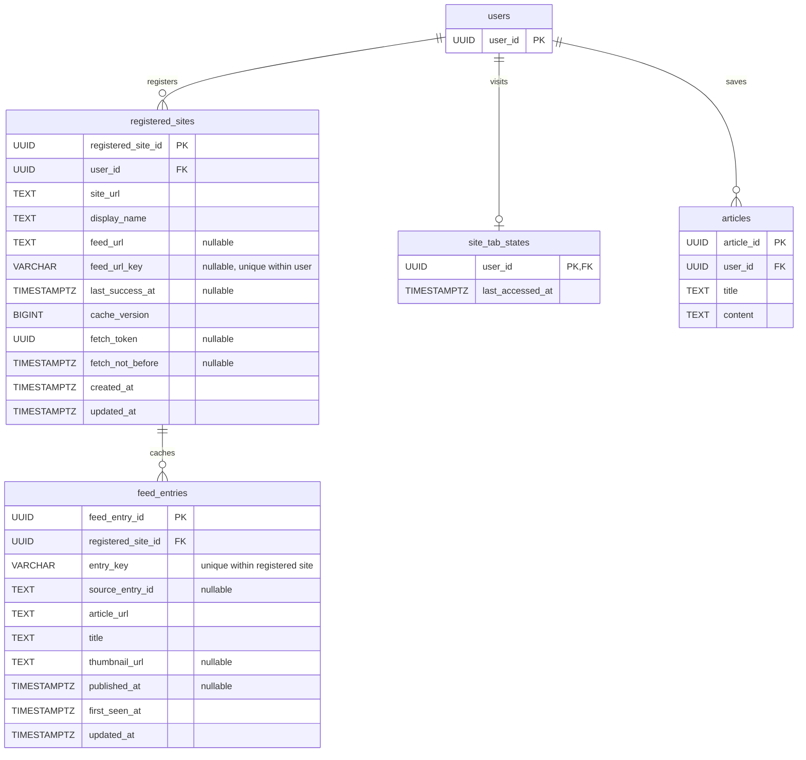

**Generated with Codex**

# 登録サイト機能の DB 設計案

Issue #83 の設計草案。ユーザが登録したサイトの RSS / Atom を取得し、記事リンクを表示する。登録サイト・記事キャッシュ・前回アクセス日時はユーザごとに管理する。同じフィード URL を別のユーザが登録した場合も、取得とキャッシュは独立する。

## ER 図

`users` と `articles` は既存テーブル。それ以外の 3 テーブルを追加する。既存の記事コメント・タグ・入力元テーブルは図から省略している。

## テーブルの責務

| テーブル | 役割 | 保持する単位 |
| --- | --- | --- |
| `registered_sites` | 登録したサイト、選択したフィード、キャッシュの成功日時と版、取得の排他制御 | ユーザ × 登録先 |
| `feed_entries` | 現在のフィードに含まれる記事カードの情報と新着判定用の日時。本文は保存しない | 登録先 × 記事 |
| `site_tab_states` | 「登録サイト」タブへの前回アクセス日時 | ユーザごとに最大 1 行 |

サイトとフィードの情報は `registered_sites` に持たせる。`feed_url` と `feed_url_key` がともに NULL の登録は、フィード非対応のリンク登録を表す。リンク登録では記事キャッシュを作らず、フィード取得も行わない。通信失敗はフィード非対応と区別し、取得を要求したユーザにエラーを返す。

新規テーブルの日時は UTC の時点として扱う。既存テーブルの日時型はこの機能では変更しない。Prisma の型名や制約名は実装時に確定する。

## 登録サイトのカラム

| カラム | 用途 |
| --- | --- |
| `registered_site_id` | 登録先の ID。記事キャッシュと API の操作対象を識別する |
| `user_id` | 登録したユーザ。取得・更新・解除の認可に使う |
| `site_url` | サイトへのリンク先 |
| `display_name` | ユーザの一覧に表示するサイト名 |
| `feed_url` | RSS / Atom の取得先。リンク登録では NULL |
| `feed_url_key` | 正規化したフィード URL の SHA-256。同じユーザによる重複登録を防ぐ |
| `last_success_at` | 最後に取得・解析が成功した日時。最終成功日時の表示とキャッシュ期限の判定に使う。NULL は取得成功前を示し、記事 0 件の取得成功とは区別する |
| `cache_version` | 記事一覧の版。初期値は 0 とし、初回取得成功と一覧の内容・構成が変わったときに増やす |
| `fetch_token` | 取得処理ごとの識別子。後続の取得が始まった後に、先行する取得結果で上書きしないために使う |
| `fetch_not_before` | 次回取得可能日時。取得開始時に DB の現在時刻の 60 秒後を設定する。NULL は取得制限なしを示す |
| `created_at` | サイトの登録日時 |
| `updated_at` | 登録情報や取得管理情報の最終更新日時。フィード取得の成功日時には使わない |

キャッシュの有効期限は `last_success_at + 1 時間` で判定する。取得エラーは API 応答で画面に返し、DB には保存しない。

## 一意制約とインデックス

| 対象 | 制約・インデックス案 | 目的 |
| --- | --- | --- |
| `registered_sites` | `INDEX(user_id)` | 自分の登録サイトを取得する |
| `registered_sites` | `UNIQUE(user_id, feed_url_key)` | 同じユーザによる同じフィードの重複登録を防ぐ。NULL のリンク登録は対象外 |
| `feed_entries` | `UNIQUE(registered_site_id, entry_key)` | 登録先の記事を重複保存しない |
| `feed_entries` | `INDEX(registered_site_id, first_seen_at DESC, entry_key DESC)` | 登録先単位のカーソルページング |
| `site_tab_states` | `PRIMARY KEY(user_id)` | 前回アクセスを 1 件で管理する |

フィード URL は意味の変わらない範囲で正規化し、SHA-256 の固定長キーを作る。記事キーはフィードが提供する ID（RSS guid / Atom id）を優先し、なければ記事 URL を使用して同様に固定長化する。元の値も保持して照合する。クエリ文字列を一律に削除するなど、異なるフィードや記事をまとめる正規化は行わない。

フィード非対応のリンク登録についても重複を防ぐ場合は、サイト URL の正規化キーと `(user_id, site_url_key)` の部分一意制約を追加する。この制約の対象は `feed_url IS NULL` とし、同一サイトの異なるフィード登録は妨げない。

## キャッシュの更新

1. 登録先の所有者を確認する。タブアクセスではキャッシュ未取得または期限切れの場合に取得し、手動更新では有効期間内でも取得する。短時間の連続取得には制限を設ける
2. 対象の `registered_sites` で `fetch_not_before` が NULL または DB の現在時刻以下であることを条件に、`fetch_not_before` を 60 秒後、新しい `fetch_token` を今回の取得識別子として同時に更新する。更新できたリクエストだけが外部取得へ進む。制限中は外部取得せず、既存キャッシュと再取得可能日時を返す。キャッシュがない場合も再試行までの待ち時間を案内する
3. DB トランザクションの外でフィードを取得・解析する。取得・解析のタイムアウトは 60 秒より短く設定する。処理が停止した場合も、次回取得可能日時を過ぎれば新しいトークンで再取得できる
4. 取得成功時は 1 トランザクションで対象の登録先をロックし、登録先の存在と今回の `fetch_token` との一致を確認してから記事を照合する。不一致または登録解除済みの場合は結果を破棄する。既存記事は `first_seen_at` を維持し、新規記事には DB 側のキャッシュ反映日時を付け、取得結果にない記事を除外する
5. 初回取得成功または記事一覧の内容・構成が変わった場合は `cache_version` を進める。`last_success_at` を更新し、取得トークンを NULL に戻す。`fetch_not_before` は変更しない

初期版では更新時にフィード全体を取得する。取得結果に変更がなければ記事の初回検出日時と版を維持し、成功日時を更新する。ETag / Last-Modified による条件付き取得は初期版の対象外とする。

取得・解析の失敗時は記事一覧・版・最終成功日時を維持し、取得を要求したユーザへエラーと再試行手段を返す。取得トークンが一致する場合のみ NULL に戻し、`fetch_not_before` は変更しない。応答サイズや処理時間の上限を超えた結果は、不完全な一覧として保存しない。

記事識別子だけの過去履歴は作らない。キャッシュから消えた記事が再登場した場合は、新しい `first_seen_at` を持つ記事として扱う。サムネイルは画像 URL のみを保持する。

## 新着判定とページング

- タブを開くときに前回アクセス日時を読み取り、その閲覧中は固定する。前回アクセス日時がない場合は、今回タブを開いた日時を判定基準にする。登録サイトがなければ空の画面を表示する
- 記事の `first_seen_at` が判定基準より後であれば新着とする。サイト登録後に初めて取得した記事はすべて新着の対象となる。初回取得が失敗した場合は、後の取得成功時に初回検出日時を付ける
- 今回のタブアクセス日時は、一覧または登録サイトなしの画面の表示成功後に `site_tab_states` へ単調増加で保存する。取得失敗だけの画面では更新しない。現在の画面の基準日時は置き換えない
- アクセス日時と初回検出日時には DB 側の共通時刻基準を使う
- ページングは `registered_site_id` を絞り、`first_seen_at DESC, entry_key DESC` で 20 件ずつ取得する
- カーソルには `registered_site_id`・`cache_version`・末尾記事のソートキーを含める。版と記事は同じ DB スナップショットで読み取り、版が異なれば再読み込みを要求する
- ページ移動やサイト切り替えでは新着判定の基準日時を変更しない。ページ移動では外部フィードを取得しない

新着は未読状態を表さない。前回開かなかったサイトやページの記事でも、次回タブアクセスでは新着表示が消える場合がある。

## 認可と削除

- 登録先の取得・更新・記事一覧・登録解除では、`registered_sites.user_id` がログインユーザと一致することを確認する。登録先や記事の ID だけでアクセスを許可しない
- 登録解除は対象ユーザの `registered_sites` の行と、紐付く `feed_entries` を連動削除する。他のユーザの登録・キャッシュと、保存済み記事には影響させない
- 取得中に登録解除された場合も、取得処理から登録先や記事キャッシュを再作成しない
- ユーザ削除時は、そのユーザの登録情報・記事キャッシュ・タブ閲覧情報を連動削除する
- `feed_entries` と保存済み `articles` の間に外部キーは設けない。保存時は URL を既存登録フローへ渡すため、キャッシュの寿命と保存記事の寿命を分離できる

## 実装前に確定する事項

キャッシュ有効期間は 1 時間、ページサイズは 20 件、取得開始から次回取得までの最短間隔は 60 秒を初期値とする。応答サイズ、解析可能な記事数、取得・解析のタイムアウトには、全サイト共通の初期値を実装時に定める。タイムアウトは取得間隔の 60 秒より短くする。代表的な RSS / Atom のサンプルで検証し、対応サイトは限定しない。取得サイズや記事数の上限は、取得結果を途中で切って正常扱いにするための値ではなく、過大な応答を拒否するための制限とする。

取得間隔の制限は DB の `fetch_not_before` でユーザの登録先単位に管理し、タブアクセス・手動更新・失敗後の再試行に共通で適用する。同一ユーザの複数タブからの要求も同じ制限を使う。画面では再取得可能日時まで更新ボタンを無効にし、残り秒数を案内する。
