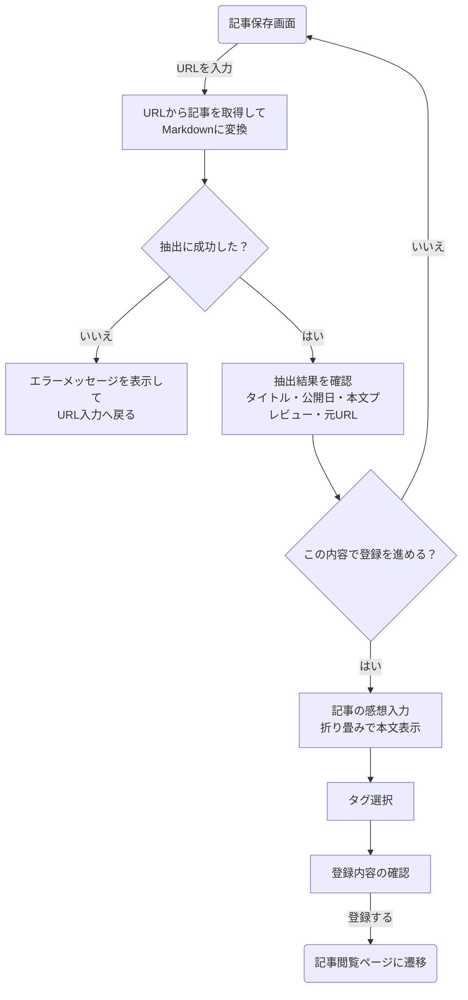

```mermaid
flowchart TD
    A(記事保存画面) -->|URLを入力| B
    B[URLから記事を取得して<br />Markdownに変換] --> C{抽出に成功した？}
    C -->|いいえ| D[エラーメッセージを表示して<br />URL入力へ戻る]
    C -->|はい| E[抽出結果を確認<br />タイトル・公開日・本文プレビュー・元URL]
    E --> F{この内容で登録を進める？}
    F -->|いいえ| A
    F -->|はい| G[記事の感想入力<br />折り畳みで本文表示]
    G --> H[タグ選択]
    H --> I[登録内容の確認]
    I -->|登録する| J(記事閲覧ページに遷移)
```
