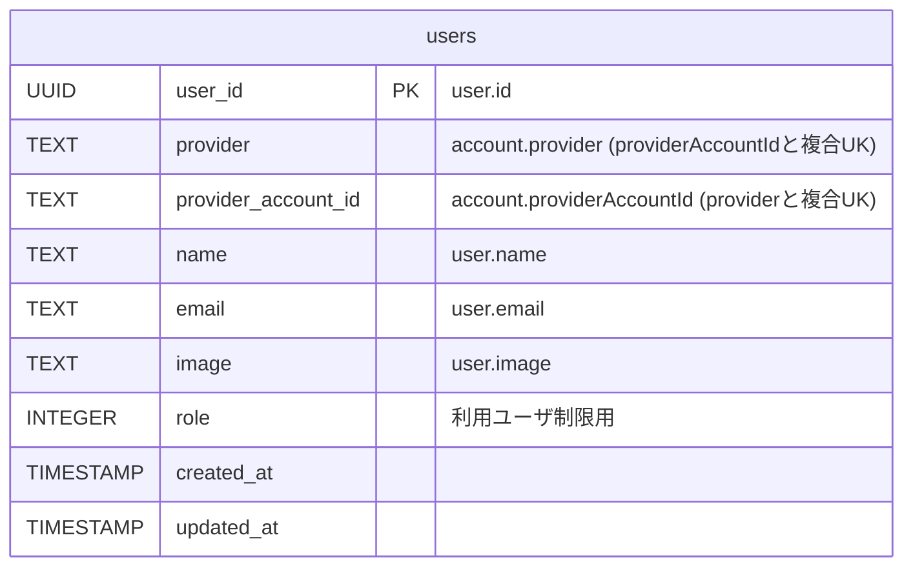

```mermaid
erDiagram
    users {
        UUID user_id PK "user.id"
        TEXT provider "account.provider (providerAccountIdと複合UK)"
        TEXT provider_account_id "account.providerAccountId (providerと複合UK)"
        TEXT name "user.name"
        TEXT email "user.email"
        TEXT image "user.image"
        INTEGER role "利用ユーザ制限用"
        TIMESTAMP created_at
        TIMESTAMP updated_at
    }
```
