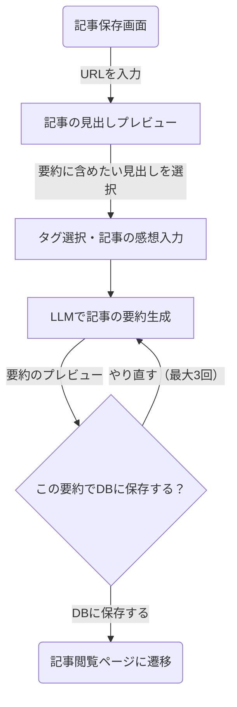

```mermaid
flowchart TD
    A(記事保存画面) -->|URLを入力| B
    B[記事の見出しプレビュー] -->|要約に含めたい見出しを選択| C
    C[タグ選択・記事の感想入力] --> D
    D[LLMで記事の要約生成] -->|要約のプレビュー| E
    E{この要約でDBに保存する？} -->|DBに保存する| F
    E{この要約でDBに保存する？} -->|やり直す（最大3回）| D
    F(記事閲覧ページに遷移)
```
