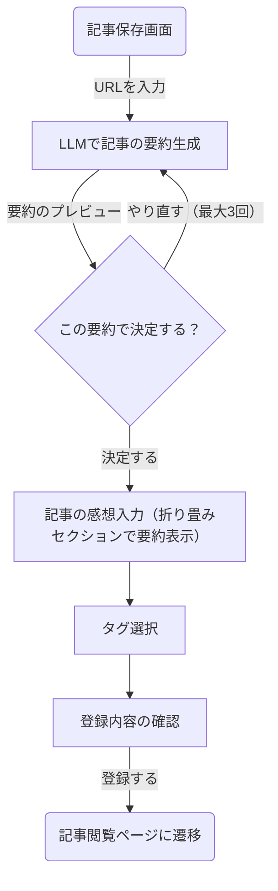

```mermaid
flowchart TD
    A(記事保存画面) -->|URLを入力| B
    B[LLMで記事の要約生成] -->|要約のプレビュー| C
    C{この要約で決定する？} -->|決定する| D
    C{この要約で決定する？} -->|やり直す（最大3回）| B
    D[記事の感想入力（折り畳みセクションで要約表示）] --> E
    E[タグ選択] --> F
    F[登録内容の確認] -->|登録する| G
    G(記事閲覧ページに遷移)
```
