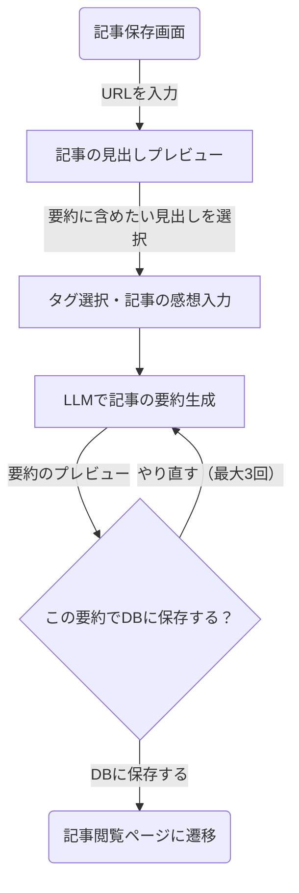

以下の記載に沿って、アプリのモックを作成してください。

# 作りたいアプリ

**Zenn・Qittaの記事URLから、記事の要約を生成して保管するアプリ**

## アプリの主要機能

- 記事の要約生成・保存
- 保存記事の閲覧

## アプリ仕様概要

### 画面について

以下の画面を整備してください。各画面の詳細は後ほど追記します。

- **記事一覧ページ**
  - URL: `/articles`
  - 保存した記事の一覧を取得・表示するページ
- **記事閲覧ページ**
  - URL: `/articles/{article_id}`
  - 記事一覧ページで選択した記事を閲覧するページ
- **記事登録ページ**
  - URL: `/articles/registration`
  - 記事のURLから記事の要約生成・記事に対する感想・タグを指定して保存するページ
- **設定ページ**
  - URL: `/settings`
  - アプリの設定などに関するページ(一旦ここはなにもなくて大丈夫です)

### UIについて

- **ダークテーマを標準とします。**
- **スマホの画面サイズに対応したUIにします。**
  - 画面サイズに応じて、デスクトップ画面用のUIと、スマホ画面用のUIを表示できるようにします。
- 以下のナビゲーション項目を含む、ナビゲーションバーを用意します。
  - 記事一覧ページ
  - 記事閲覧ページ
  - 記事登録ページ
  - 設定ページ
- ナビゲーションバーの位置は、以下のように画面サイズに応じて変更します。
  - デスクトップ：サイドバー
    - 上から順に「記事一覧ページ」「記事閲覧ページ」「記事登録ページ」「設定ページ」としてください。
  - スマホサイズ：ボトムバー
    - 左から順に「記事一覧ページ」「記事閲覧ページ」「記事登録ページ」「設定ページ」としてください。
- 各画面のボタンには適切なアイコン画像を使用し、ホバーした際に説明が出るようにしてください。

### 認証機能について

- Auth.jsを用いた認証機能を実装予定です。念のため伝達しておきます。

## 各画面の詳細仕様

### 記事一覧ページ

- 保存した記事の一覧を取得・表示するページ
- 表示形式は以下とします。
  - アイコングリッド (デフォルト)
  - リスト形式
- ソート項目は以下とします。
  - 記事を登録した順 (新しい順をデフォルト)
  - 記事のタイトル名順
- タグによるグループ機能
  - 記事に登録されているタグごとにグルーピングして表示します。
  - 複数のタグがある場合はどちらにも表示します。
  - タグがない記事は「タグなし」としてグルーピングして表示してください。
- 記事の削除機能
  - 赤いゴミ箱ボタンとかで、指定された記事を削除します。
    - X(Twitter)のブックマークを解除するのと同等のイメージです。
  - ボタン押下時は、ダイアログで確認が出るようにしてください。
- ページネーション機能
  - 1ページ20件ずつ記事を取得するようにしたいです。
  - クエリパラメータを利用してください。

### 記事閲覧ページ

- 記事一覧ページで選択した記事を閲覧するページ
- **記事はマークダウンで表示されるようにしてください。**
- テンプレートは以下です。

```
# 記事タイトル - {(記事リンクのサービス名(Zenn, Qittaなど))}

#### 投稿日時：{記事の投稿日時}

#### タグ：{記事のタグ(リンクで記事一覧ページ飛べたらナイス)}

> 記事リンクの引用

---

{ここに記事の要約}

---

## 感想・コメント

{ここに記事の感想}
```

- 画面上部(タイトルの上あたり)にナビゲーションを行うボタン群を用意してください。
  - このボタン群は、記事を読むためにしたスクロールした際も固定で表示されるようにしてください。
  - 左側に「記事一覧ページ」に戻るボタン
  - 右側に「記事編集」ボタン・「記事削除」ボタン
  - 記事編集ボタンについて
    - 記事のタグ・コメントを編集・更新できる画面に遷移します。
    - URLは`/articles/{article_id}/edit`とします。

### 記事登録ページ

- 記事のURLから記事の要約生成・記事に対する感想・タグを指定して保存するページ
- 記事保存のフローチャートは以下です。以降はこのフローの順番に従って説明します。



- 画面アクセス後はURL入力のテキストボックスを初期表示とします。
- URL入力後、記事の見出しのプレビューを表示します。
  - ローディングのアニメーションを表示してください。
- 要約に含めたい見出しをユーザに選択させるため、記事の見出しをチェックボックスなどで選択可能にしてください。
- 記事に紐づけるタグ選択ボタンを用意してください。押下するとタグ一覧のポップアップが表示されるようにしてください。
  - GitHubのissueからタグを選択できるイメージです。
  - ポップアップ下部にGitHubと同様のタグ編集ボタンを配置してください。
    - 押すとタグ一覧画面に遷移します。
      - GitHubのタグ一覧と同じイメージです
      - URLは`/article-tags`としてください。
- 記事の感想を入力するテキストボックスを用意してください。
  - マークダウン形式の入力を受け付けてください。
  - 最大1000文字としてください。
- 「記事の要約を生成する」ボタンを用意してください。
  - ローディングのアニメーションを表示してください。
- 記事の要約のプレビューを表示してください。
  - この要約内容で保存するかを確認するテキストを表示し、「保存する」「やり直す (あとn回)」ボタンを表示してください。
  - 「保存する」ボタンが押されたら、記事をDBに保存します。
    - ローディングのアニメーションを表示してください。
    - 保存が成功したら、記事が保存された旨を伝えるテキストを表示してください。
    - 「保存した記事を見る」・「記事一覧を見る」といった内容のボタンを用意してください。
      - それぞれ、「記事閲覧ページ」と「記事一覧ページ」に飛ぶようにしてください。

### 設定ページ

- アプリの設定などに関するページ
- 現状表示する項目がないため、「準備中...」とだけ表示してください。

## 最後に

上記の詳細的な仕様については、**思いついた範囲でしか記載できていません。**

そのため、不足がある点は補い、より良いUX体験が予想できる箇所については独自のUIとするなど、適切な判断を行ってください。
